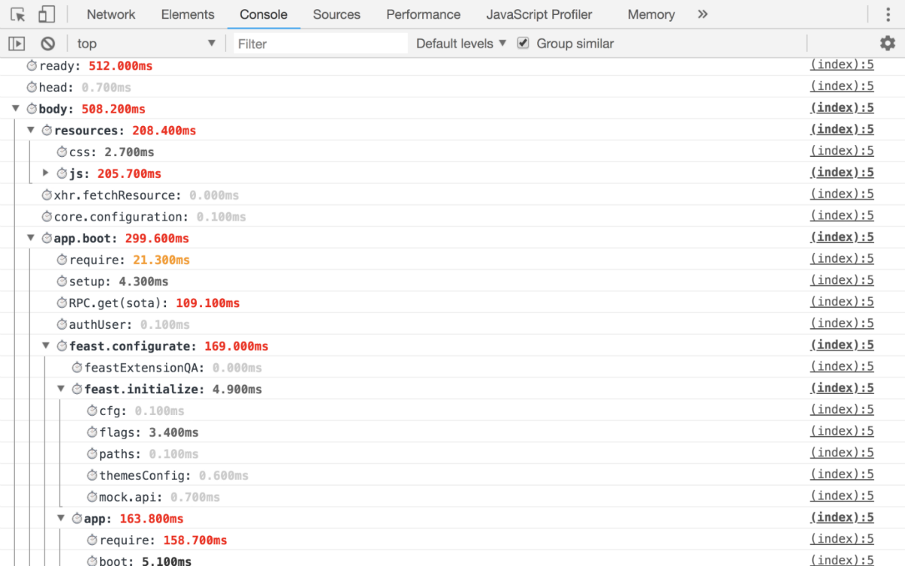
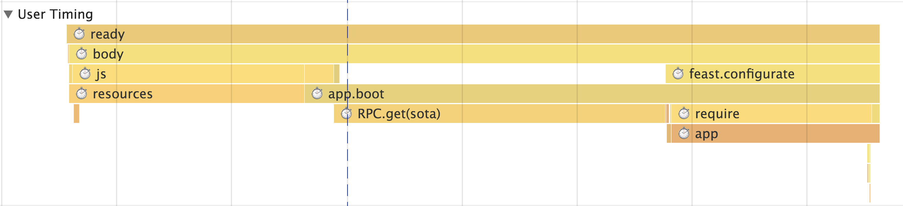

@perf-tools/keeper (aka PerfKeeper)
-----------------------------------
PerfKeeper — It's a tool for performance monitoring and profiling your application (also best replacement for `console.time`).

- ➡️ &nbsp; [Living example of work](https://artifact-project.github.io/perf-tools/keeper/) &nbsp; 😲

```sh
npm i --save @perf-tools/keeper
```

---

### Features

 - Groups! 🗂
 - DevTools -> Performance -> UserTiming 💡
 - Output -> DevTools / Console or custom output 💬
 - Out of box ⚡️
   - Monitorings ⏱
	 - [FPS](./ext/fps) 🌀
     - [Navigation Timings](./ext/navigation) 🚏
     - [Paint Timings](./ext/paint) 🏞
	 - [Performance](./ext/performance) 🚀
	 - [Resource/Traffic](./ext/resource) ⚖️
	 - [Memory](./ext/memory) 🤖
   - Analytics 📈
     - [Google](./analytics/google)
     - [Yandex](./analytics/yandex)

---

### Usage

```ts
// System keeper
import { system } from '@perf-tools/keeper';


// Custom keeper
import { create } from '@perf-tools/keeper';
import { googleAnalytics } from '@perf-tools/keeper/analytics/google';

const keeper = perfKeeper.create({
	print: true,    // DevTools -> Console
	timeline: true, // DevTools -> Performance -> User timings
	prefix: '⏱',
	analytics: [
		googleAnalytics({prefix: 'MyApp-'}),
	],
});

// 1. Classic usage variant
keeper.time('FooBar');
// ...
keeper.timeEnd('FooBar'); // ⏱FooBar: 37ms

// 2. Shorted usage variant
const timer = keeper.time('FooBar'); // ⏱FooBar: 37ms
// ...
timer.stop();

// 3. Functional usage variant
keeper.time('FooBar', () => { // ⏱FooBar: 37ms
	// ...
});

// 4. Usage variant with groups
const group = keeper.group('App');
group.mark('init'); // starting 'init' timer
// ...

group.mark('prepare'); // ending 'init' and starting 'prepare' timer
// ...

group.mark('render'); // ending 'prepare' and starting 'render' timer
// ...

group.stop(); // starting 'render' timer

// ⏱App: 382ms
//    ⏱init: 243ms
//    ⏱prepare: 19ms
//    ⏱render: 120ms
```


### Inline Usage

```html
<html>
<head>
	<script>
		/**
		 * Replace this comment on the code from this files:
		 *  - ./dist/perf-keeper.js
		 *  - ./dist/perf-keeper.extentions.js
		 *  - ./dist/perf-keeper.analytics.google.js
		 */

		// Setup system keeper
		perfKeeper.system.print(true);
		perfKeeper.system.setAnalytics([perfKeeperAnalyticsGoogle.googleAnalytics()]);
		perfKeeperExtentions.set(perfKeeper.system);

		// Create custom keeper
		var keeper = perfKeeper.create({
			print: true,    // DevTools -> Console
			timeline: true, // DevTools -> Performance
			prefix: '⏱',
			analytics: [
				perfKeeperAnalyticsGoogle.googleAnalytics({
					prefix: 'MyApp-',
				}),
			],
		});
		keeper.group('head');
	</script>

	<script>
		keeper.time('icon');
	</script>
	<link rel="shortcut icon" type="image/x-icon" href="..."/>
	<link rel="apple-touch-icon" href="..." />
	<!-- etc -->
	<script>
		keeper.timeEnd('icon');
		keeper.time('css');
	</script>
	<link type="text/css" rel="stylesheet" href="..."/>
	<!-- etc -->
	<script>
		keeper.timeEnd('css');
		keeper.groupEnd();
	</script>
</head>
<body>
	<script>
		keeper.group('body');
	</script>
	<!-- ... -->
	<script>
		keeper.time('javascript');
	</script>
	<script src="./boot/loader"></script>
	<!-- etc -->
	<script>
		keeper.timeEnd('javascript');

		const gapp = keeper.group('app', true);

		gapp.mark('require');
		require(['app/bootstrap'], (bootstrap) => {
			gapp.mark('boot');
			bootstrap(document);
			gapp.stop();
		});
	</script>
	<!-- ... -->
	<script>
		keeper.groupEnd();
	</script>
</body>
</html>
```

---

### API

- **create**(options: `KeeperOptions`): `PerfKeeper`
  - **options**
    - **disabled**: `boolean` — turn off the work PerfKeeper (optional)
    - **print**: `boolean` — on/off output to console (optional)
	- **perf**: `Partial<Performance>` — custom object like `performance` (optional)
	- **console**: `Partial<Console>` — custom object like `console` (optional)
	- **timeline**: `boolean` — on/off usage DevTools -> User Timings (optional)
	- **analytics**: `Array<(entry: PerfEntry) => void>`
	- **warn**: `(msg: string) => void` — callback for catching internal warnings (optional)
  - **PerfKeeper**, instance methods:
    - **print**: `(enable?: boolean) => void`
    - **disable**: `(state: boolean) => void`
    - **setAnalytics**: `(list: Array<(entry: PerfEntry) => void>) => void`
    - **add**(name: `string`, start: `number`, end: `number`, unit?: `string`): `Entry`
    - **time**(name: `string`, callback: `() => void`): `Entry` — measure execution time of callback
    - **time**(name: `string`, start?: `number`): `Entry` — start timer
    - **timeEnd**(name: `string`, end?: `number`): `void` - stop timer by label
    - **group**(name: `string`): `GroupEntry`
    - **group**(name: `string`, isolate: `true`): `GroupEntry`
    - **group**(name: `string`, start: `number`, isolate?: `true`): `GroupEntry`
    - **groupEnd**(name?: `string`, end?: `number`): `void`
  - **Entry**
    - **id**: `string` — unique identifier
    - **unit**: `'ms' | 'KiB' | 'fps' | 'raw'` — metric unit
    - **name**: `string` — name of measure
    - **start**: `number` — start mark
    - **end**: `number` — end mark
    - **parent**: `PerfGroupEntry | null` — reference on parent
    - **stop**(end?: `number`): `void` — complete the measurement (set `end` prop)
  - **GroupEntry** (extends `Entry`)
    - **entries**: `Entry[]` — nested metrics
    - **add**(name: `string`, start: `number`, end: `number`, unit?: `string`): `Entry`
    - **time**(name: `string`, start?: `number`): `Entry`
    - **timeEnd**(name: `string`, end?: `number`): `void`
    - **mark**(name: `string`): `void` — start the timer with stopping a previous one in the group.
    - **group**(name: `string`, unit?: `string`): `GroupEntry`
    - **stop**(end?: `number`): `void` — complete the measurement of group (set `end` prop)

---

### Examples

#### Console



---

#### User Timing aka Timeline



---

### Development

 - `npm i`
 - `npm test`, [code coverage](./coverage/lcov-report/index.html)
