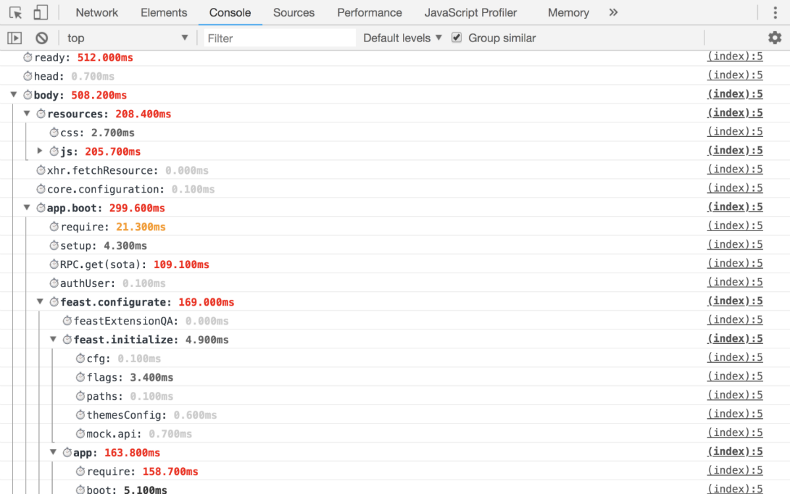
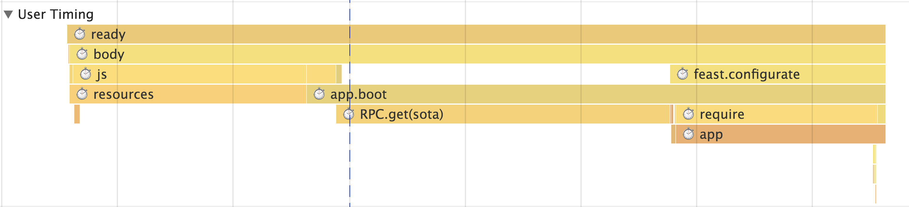

@perf-tools/timekeeper
----------------------
Time profiling helper

```
npm i --save @perf-tools/timekeeper
```

### Usage

```html
<html>
<head>
	<script>
		/**
		 * Replace this comment on the code from this file:
		 * https://github.com/artifact-project/perf-tools/blob/master/timekeeper/timekeeper.js
		 */
		var keeper = timekeeper.create({
			print: true,    // DevTools -> Console
			timeline: true, // DevTools -> Performance
			prefix: '⏱',
		});
		keeper.group('head');
	</script>

	<script>
		keeper.time('icon');
	</script>
	<link rel="shortcut icon" type="image/x-icon" href="..."/>
	<link rel="apple-touch-icon" href="..." />
	<!-- etc -->
	<script>
		keeper.timeEnd('icon');
		keeper.time('css');
	</script>
	<link type="text/css" rel="stylesheet" href="..."/>
	<!-- etc -->
	<script>
		keeper.timeEnd('css');
		keeper.groupEnd();
	</script>
</head>
<body>
	<script>
		keeper.group('body');
	</script>
	<!-- ... -->
	<script>
		keeper.time('javascript');
	</script>
	<script src="./boot/loader"></script>
	<!-- etc -->
	<script>
		keeper.timeEnd('javascript');

		keeper.group('app');
		keeper.time('require');
		require(['app/bootstrap'], keeper.wrap(function (bootstrap) {
			keeper.timeEnd('require');

			keeper.time('boot');
			bootstrap(document)
			keeper.timeEnd('boot');
		}));
		keeper.groupEnd('app');
	</script>
	<!-- ... -->
	<script>
		keeper.groupEnd();
	</script>
</body>
</html>
```

---

### API

- **create**(options: `KeeperOptions`): `Keeper`
  - **options**
    - **print**: `boolean`
	- **perf**: `Partial<Performance>`
	- **console**: `Partial<Console>`
	- **timeline**: `boolean`
  - **Keeper**
    - **time**(name: `string`)
    - **timeEnd**(name: `string`)
    - **group**(name: `string`)
    - **groupEnd**(name?: `string`)
    - **wrap**`<R>`(fn: `(...args: A) => R`): `(...args: A) => R`

---

### Examples

#### Console



---

#### User Timing aka Timeline



---

### Development

 - `npm i`
 - `npm test`, [code coverage](./coverage/lcov-report/index.html)
